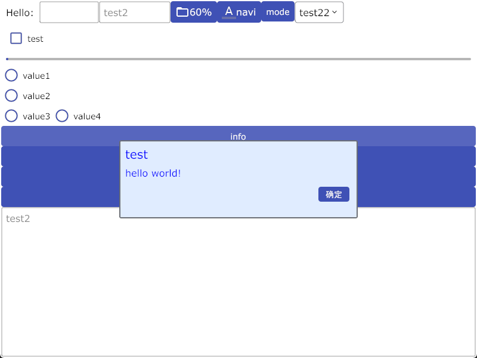
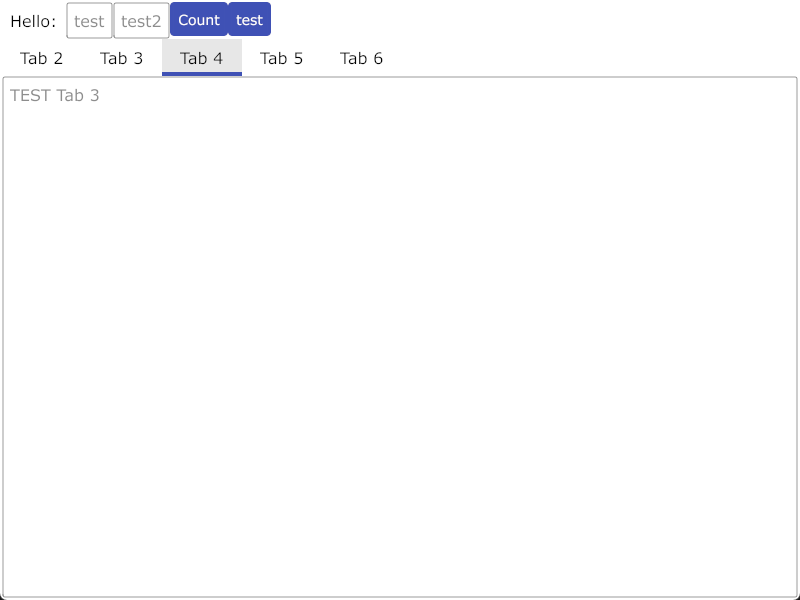

# gui

#### 介绍
gioui 的简单封装

alarm


push


demo1



demo2



#### 软件架构
软件架构说明


#### 安装教程

1. 编译 windows
```
go build -ldflags "-H windowsgui"
```
2. 编译Android
```
gogio -target android -icon logo.png -signkey "E:\android\test.keystore" -signpass xxxxx .
```
xxxxx 替换为签名密码

3.  xxxx

#### 使用说明

1.  示例
```

type Boss struct {
	//pages
	win  *gui.Window
	man  *PageMain
	msg  *PageMsg
	push *PagePush
	me   *PageMe

	//icons
	info  image.Image
	warn  image.Image
	erron image.Image
}

func Init() *gui.Window {
	win := gui.NewWindow(gui.WithLog(log.Println))
	win.Option(
		app.Title("Alarm test"),
		app.Size(unit.Dp(800), unit.Dp(600)),
	)

	boss.Init(win)

	titles, contents := boss.GetPages()
	navi := gui.NewNavibar(win, titles, contents)
	navi.SetSelected(1)
	win.SetContent(navi)
	return win
}

func main() {
	gui.Run(Init)
}

func (m *Boss) Init(win *gui.Window) {
	m.win = win
	log.Println("data dir:", win.DataDir())
	m.loadJpeg()

	boss.man = NewPageMain(win, "main", "首页")
	boss.msg = NewPageMsg(win, "msg", "通知")
	boss.push = NewPagePush(win, "push", "推送")
	boss.me = NewPageMe(win, "me", "我的")
}

func (m *Boss) GetPages() (titles []string, contents []gui.Contenter) {
	titles = []string{boss.man.Title(), boss.msg.Title(), boss.push.Title(), boss.me.Title()}
	contents = []gui.Contenter{boss.man, boss.msg, boss.push, boss.me}
	return
}

```
2.  xxxx
3.  xxxx

#### 参与贡献

1.  Fork 本仓库
2.  新建 Feat_xxx 分支
3.  提交代码
4.  新建 Pull Request


